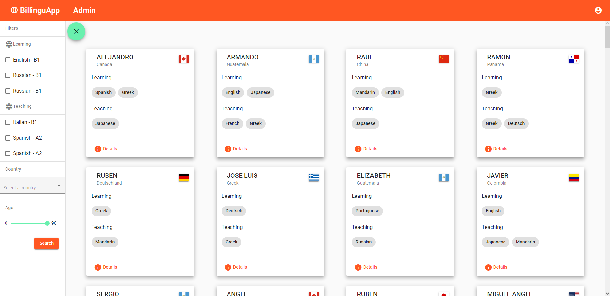
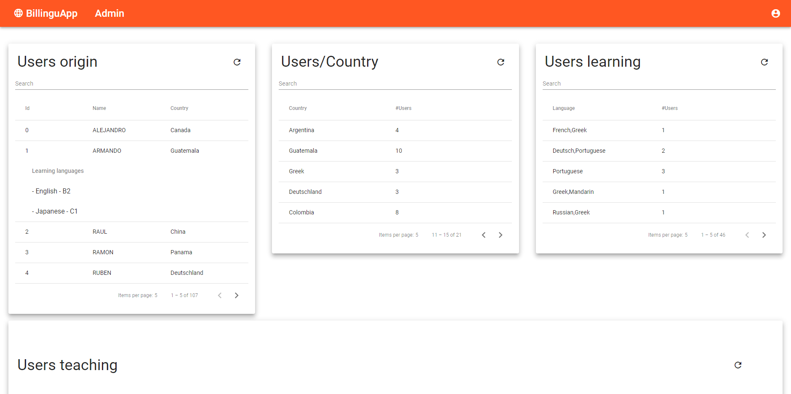
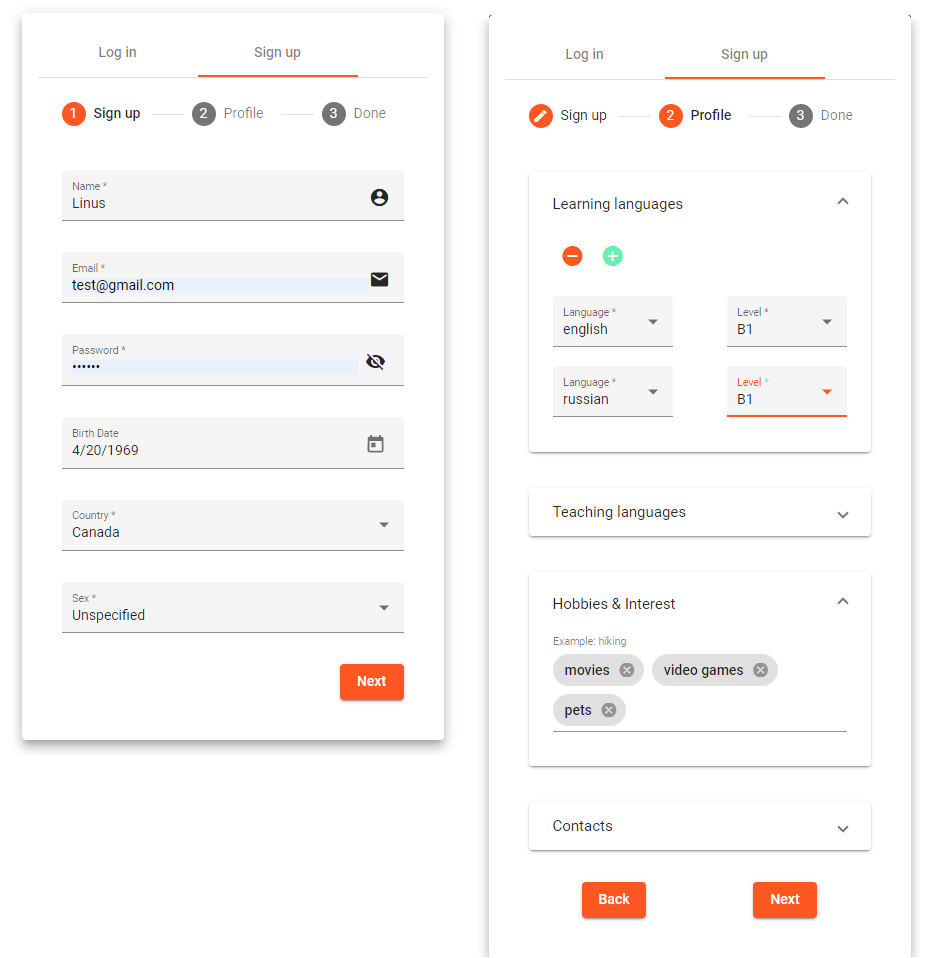

# BilinguAppWeb 🌎

BilinguApp is a place where you can meet people all around the world to learn new languages and teach to others. It's built using **Angular** for web,  **Python** for a service API, **Mongo Atlas** for managing a distributed data base.

Main features:

* Material design
* Responsive
* Search filters
* Easy to use admin page
* Dynamic table with filters, sort and pagination
* Authentication system for multiple roles

## Photos 📷

Home                         |
:----------------------------:|
       |

Admin                         |
:----------------------------:|
       |

Auth                          |
:----------------------------:|
        |

## Authors 👨🏻💻

* **Jose D. Acuña** - *Web Functionality Manager & Lead Designer* - [JoDaniel1412](https://github.com/JoDaniel1412)
* **Crisptofer Fernandez F.** - *Database Administration & Definition* - [crisptofer12ff](https://github.com/crisptofer12ff)
* **Oscar Gonzalez Alfaro** - *Lead Developer on Back-end and Connections* - [Racso08](https://github.com/Racso08)
* **Esteban Zúñiga** - *Database Administration & Definition* - [Chaos1497](https://github.com/Chaos1497)

# Deployment 🛠

This project was generated with [Angular CLI](https://github.com/angular/angular-cli) version 9.1.12.

## Development server 🖥

Run `ng serve` for a dev server. Navigate to `http://localhost:4200/`. The app will automatically reload if you change any of the source files.

## Code scaffolding 💻

Run `ng generate component component-name` to generate a new component. You can also use `ng generate directive|pipe|service|class|guard|interface|enum|module`.

## Build 🔨

Run `ng build` to build the project. The build artifacts will be stored in the `dist/` directory. Use the `--prod` flag for a production build.

## Running unit tests ⚙

Run `ng test` to execute the unit tests via [Karma](https://karma-runner.github.io).

## Running end-to-end tests 🔧

Run `ng e2e` to execute the end-to-end tests via [Protractor](http://www.protractortest.org/).

## Further help ❔

To get more help on the Angular CLI use `ng help` or go check out the [Angular CLI README](https://github.com/angular/angular-cli/blob/master/README.md).

## License 📄

This project is licensed under the MIT License - see the [LICENSE.md](https://github.com/JoDaniel1412/eBike/blob/main/LICENSE.md) file for details

## Acknowledgments 📎

* Costa Rica Institute of Technology

                                

This project was made with academical purposes.

