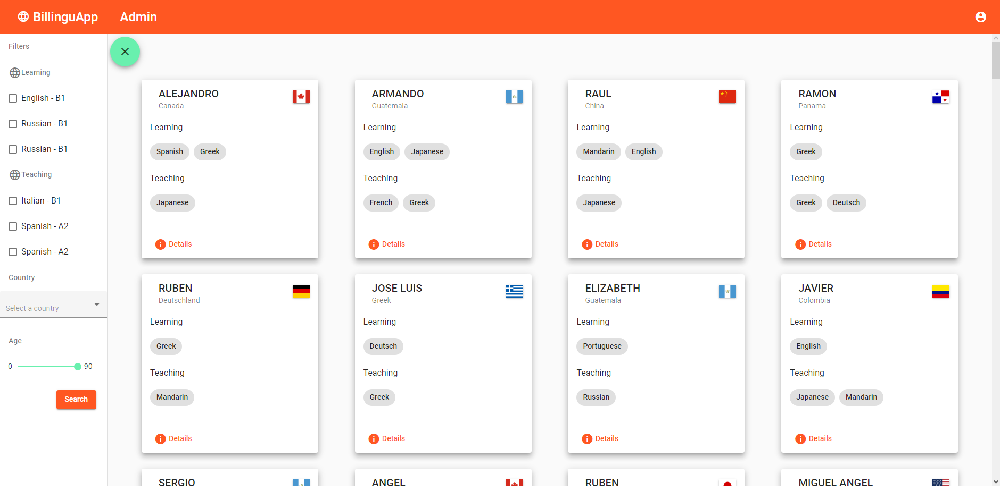
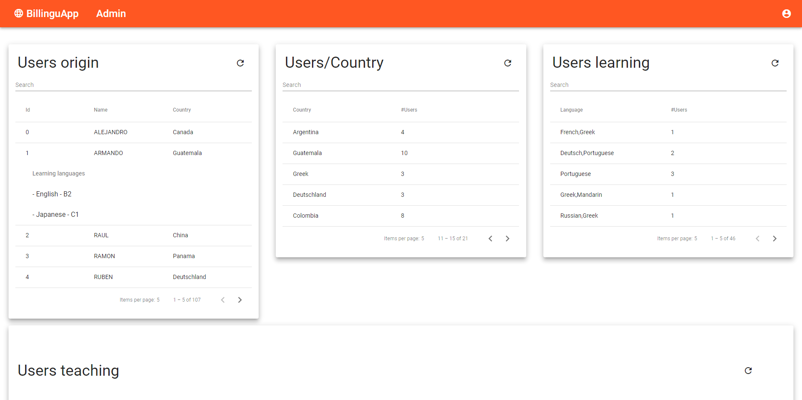
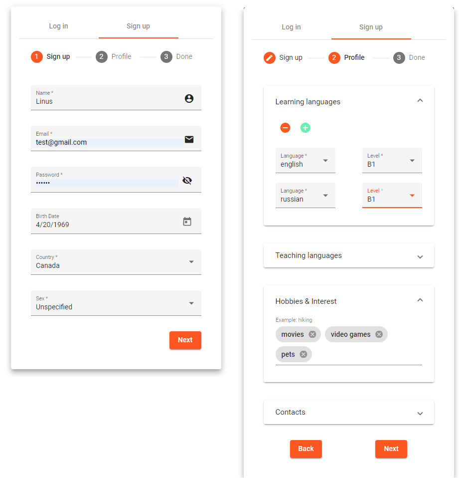

# BilinguApp 🌎

BilinguApp is a place where you can meet people all around the world to learn new languages and teach to others. It's built using **Angular** for web,  **Python** for a service API, **Mongo Atlas** for managing a distributed data base.

Main features:

* Material design
* Responsive
* Search filters
* Easy to use admin page
* Dynamic table with filters, sort and pagination
* Authentication system for multiple roles

## Photos 📷

Home                         |
:----------------------------:|
       |

Admin                         |
:----------------------------:|
       |

Auth                          |
:----------------------------:|
        |

## Authors 👨🏻💻

* **Jose D. Acuña** - *Web Functionality Manager & Lead Designer* - [JoDaniel1412](https://github.com/JoDaniel1412)
* **Crisptofer Fernandez F.** - *Database Administration & Definition* - [crisptofer12ff](https://github.com/crisptofer12ff)
* **Oscar Gonzalez Alfaro** - *Lead Developer on Back-end and Connections* - [Racso08](https://github.com/Racso08)
* **Esteban Zúñiga** - *Database Administration & Definition* - [Chaos1497](https://github.com/Chaos1497)

## Build 🔨

Go to BilinguAppWeb [README.md](BilinguAppWeb/README.md)

## License 📄

This project is licensed under the MIT License - see the [LICENSE.md](LICENSE.md) file for details

## Acknowledgments 📎

* Costa Rica Institute of Technology

                                

This project was made with academical purposes.

